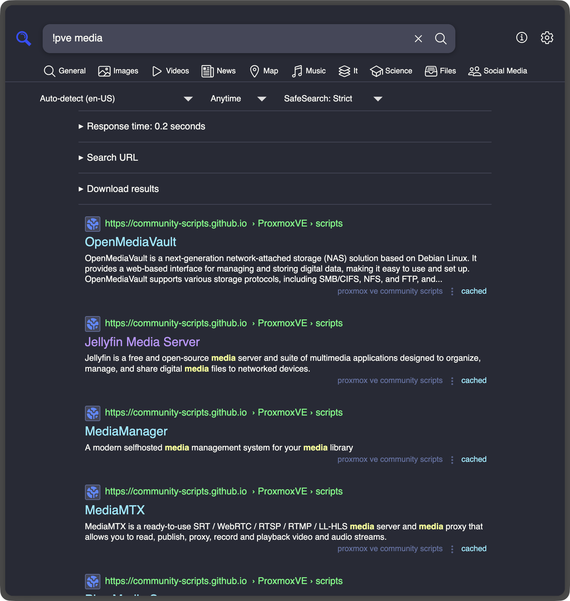

# SearXNG Engine: Proxmox VE Community Scripts

A [SearXNG](https://github.com/searxng/searxng) engine that searches the [Proxmox VE Community Scripts](https://community-scripts.github.io/ProxmoxVE/) catalogue: ~480 install scripts for LXC containers, VMs, and add-ons.

Instead of navigating to the community scripts site, search the catalogue directly from SearXNG — intermixed with broader results or exclusively via the `!pve` bang. Anything that connects to your SearXNG instance (like [Seek: SearXNG for Alfred](https://github.com/ggfevans/searxng-seek-alfred)) gets access to the catalogue automatically.



## Features

- **Offline search** — queries never leave your instance
- **No extra dependencies** — built entirely on SearXNG's network stack (`searx.network`) and SQLite cache (`EngineCache`)
- **Cache resilience** — if the upstream API is unreachable, the engine serves results from the existing cache
- **AND-logic scoring** — all query words must match; +10 name, +5 description

## How it works

On startup, the engine fetches the full script catalogue via `searx.network.get` and caches each script individually through SearXNG's `EngineCache` (SQLite-backed, 12 h TTL). After that, all searches run entirely offline — no per-query network requests.

## Installation

### 1. Copy the engine file

Find your SearXNG engines directory, then copy the engine file:

```bash
# Find your SearXNG engines directory:
ls /usr/local/searxng/searxng-src/searx/engines/   # community scripts LXC
# Or dynamically:
python3 -c "import searx; print(searx.__path__[0] + '/engines')"

# Then copy the engine file:
cp searx/engines/community_scripts_proxmoxve.py /path/to/searx/engines/
```

### 2. Add to settings.yml

Add this block under `engines:` in your SearXNG settings file (typically `/etc/searxng/settings.yml`):

```yaml
  - name: proxmox ve community scripts
    engine: community_scripts_proxmoxve
    shortcut: pve
    categories: [it]
    disabled: false   # the engine ships disabled by default; set to false to enable on your instance
```

> **Note:** The engine defaults to `disabled: true` (opt-in) for upstream safety. The snippet above uses `disabled: false` because you are installing it on your own instance and want it active immediately. See `settings-snippet.yml` for an upstream-ready example.

### 3. Restart SearXNG

```bash
systemctl restart searxng
```

## Usage

Results appear under the **IT** tab alongside other engines. Use the `!pve` bang to search the catalogue exclusively:

- `!pve docker` — Docker LXC, Dockge, etc.
- `!pve reverse proxy` — Nginx Proxy Manager, Traefik, Caddy
- `!pve adguard` — AdGuard Home LXC

## Acknowledgements

This project was developed with [Claude Code](https://claude.ai/claude-code) by Anthropic.

## Licence

[](LICENSE)

This project is licensed under the [GNU Affero General Public License v3.0](LICENSE), the same licence as SearXNG.
